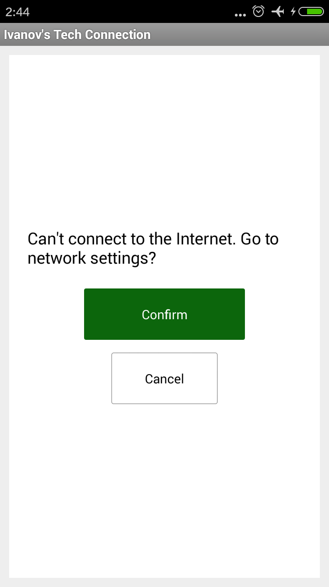

Connection
==========

Протокол обеспечения доступа в интернет. Автоматически проверяет доступность интернета, перед выполнением нужной операции.
Полезно если для выполнения операции критически важн иметь доступ в интернет.
  
__1.__      Автоматически создает и показывает диалоги, используя `SupportFragmentManager`
__2.__      Самостоятельно регистрирует и удаляет `BroadcastReciever` (`android.net.conn.CONNECTIVITY_CHANGE`). Благодаря этому, диалог "Нет доступа в интернет" автоматически закрывается как только появляется доступ в интернет.

Пример использования
--------------------

```java
import com.ivanov.tech.connection.Connection;
```

```java
Connection.checkConnection(getActivity, getFragmentManager(),R.id.main_container, new Status(){
				@Override
				public void isConnected() {					
					// Ваш код, когда есть доступ к интернету
				}

				@Override
				public void onCanceled() {
					// Когда нет доступа к интернету. При нажатии "Cancel" или кнопки "Назад"
				}
			}
);
```
Аргументы:
* `getActivity` - контекст активити
* `getFragmentManager` - `supportFragmentManager` из actionbarsherlock
* `R.id.main_container` - передается лэйоут используемый в качестве окна активити
* ```java new Status()``` - реализация интерфэйса `Status` для обратного вызова

Если в момент вызова `Connection.checkConnection(..)` есть доступ к интернету, то вызывается метод `isConnected` переданного Status объекта; 
иначе создается и открывается фрагмент `ConnectionFragment`:



При нажатии "Confirm" переходим к "Настройки сети" телефона. При нажатии "Cancel" фрагмент закрывается, 
и вызывается метод `onCanceled` переданного Status объекта

При создании, `ConnectionFragment` самостоятельно регистрирует `BroadcastReciever`, который вызывает `isConnected` в случае появления интернета.
 
Добавление проекта в Eclipse
----------------------------
* Для работы Connection требуется [ActionBarSherlock][1]
* Добавьте проект Conneсtion в Workspace. 
* Установите ActionBarSherlock в качестве библиотеки
* Выполните Project->Clean

Запуск демонстрационного приложения:
------------------------------------
* Выполните все из "Добавление проекта в Eclipse"
* Удостоверьтесь что проект НЕ БИБЛИОТЕКА. Перейдите Project->Properties->Android, УБЕРИТЕ галочку isLibrary (находится внизу окна), нажмите "Apply"
* Можно запустить

Использование в своем проекте:
------------------------------
* Выполните все из "Добавление проекта в Eclipse"
* Сделайте проект Connection библиотекой
* Добавьте проект Connection в качестве библиотеки в ваш проект
* В манифесте добавьте строки:
```xml
	<uses-permission android:name="android.permission.ACCESS_WIFI_STATE" />
    <uses-permission android:name="android.permission.ACCESS_NETWORK_STATE" />
    <uses-permission android:name="android.permission.CHANGE_WIFI_STATE" />
    <uses-permission android:name="android.permission.INTERNET" />
```

[1]: http://actionbarsherlock.com/
