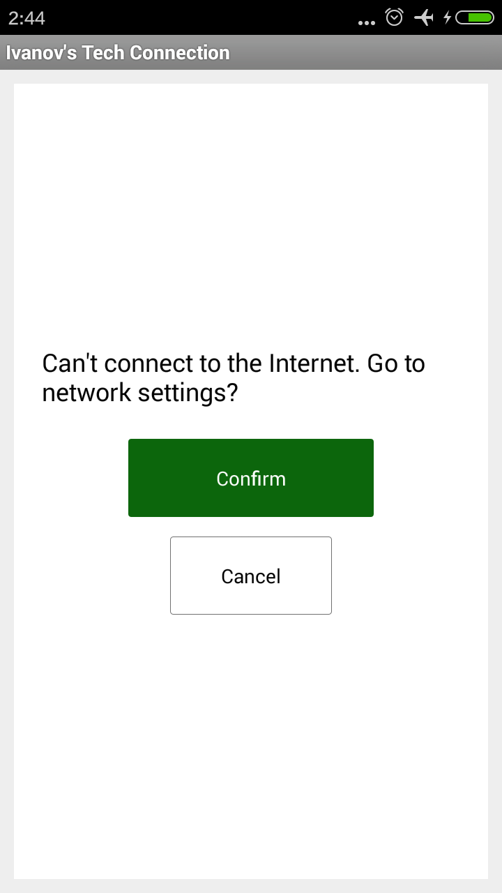

Connection
==========

Протокол обеспечения доступа в интернет. Автоматически проверяет доступность интернета, перед выполнением нужной операции. Если операция исполняется через протокол "Connection", то исполнение операции начнется только, если все условия протокола "Connection"(есть доступ в интернет) выполнены. В противном случае будет показан диалог, с возможностью отмены операции.

Полезно если для выполнения операции критически важно иметь доступ в интернет.
  
* Автоматически создает и показывает диалоги, используя `SupportFragmentManager`
* Самостоятельно регистрирует и удаляет `BroadcastReciever` (`android.net.conn.CONNECTIVITY_CHANGE`). Благодаря этому, диалог "Нет доступа в интернет" автоматически закрывается как только появляется доступ в интернет.

Пример использования
--------------------

```java
import com.ivanov.tech.connection.Connection;
```

```java
Connection.protocolConnection(getActivity(), getFragmentManager(),R.id.main_container, new ProtocolListener(){
				@Override
				public void isCompleted() {					
					//Все условия протокола выполнены
					yourOperation();
				}

				@Override
				public void onCanceled() {
					//Пользователь нажал "Cancel"
				}
			});
```
Аргументы:
* `getActivity` - контекст активити
* `getFragmentManager` - `supportFragmentManager` из actionbarsherlock (Внимание! Не путайте с нативным getFragmentManager)
* `R.id.main_container` - передается layout используемый в качестве окна активити, тогда диалог будет показан на весь экран. Если передать другой layout, то в качестве окна диалога будет использован переданный вами layout
* ```java new ProtocolListener``` - реализация интерфэйса `ProtocolListener` для обратного вызова. Тут передается операция (другими словами ваш код)

Если в момент вызова `Connection.protocolConnection(..)` есть доступ к интернету, то вызывается метод `isCompleted` переданного `ProtocolListener` объекта; 
иначе создается и открывается фрагмент `FragmentNoConnection`:



При нажатии "Confirm" переходим к "Настройки сети" телефона. При нажатии "Cancel" фрагмент закрывается, 
и вызывается метод `onCanceled` переданного Status объекта

При создании, фрагмент `FragmentNoConnection` самостоятельно регистрирует `BroadcastReciever`, который вызывает `isConnected` в случае появления интернета.
 
Добавление проекта в Eclipse
----------------------------
* Для работы Connection требуется [ActionBarSherlock][1]
* Добавьте проект Conneсtion в Workspace. 
* Установите ActionBarSherlock в качестве библиотеки
* Выполните Project->Clean

Запуск демонстрационного приложения:
------------------------------------
* Выполните все из "Добавление проекта в Eclipse"
* Удостоверьтесь что проект НЕ БИБЛИОТЕКА. Перейдите Project->Properties->Android, УБЕРИТЕ галочку isLibrary (находится внизу окна), нажмите "Apply"
* Можно запустить

Использование в своем проекте:
------------------------------
* Выполните все из "Добавление проекта в Eclipse"
* Сделайте проект Connection библиотекой
* Добавьте проект Connection в качестве библиотеки в ваш проект
* В манифесте добавьте строки:
```xml
	<uses-permission android:name="android.permission.ACCESS_WIFI_STATE" />
    <uses-permission android:name="android.permission.ACCESS_NETWORK_STATE" />
    <uses-permission android:name="android.permission.CHANGE_WIFI_STATE" />
    <uses-permission android:name="android.permission.INTERNET" />
```

[1]: http://actionbarsherlock.com/
